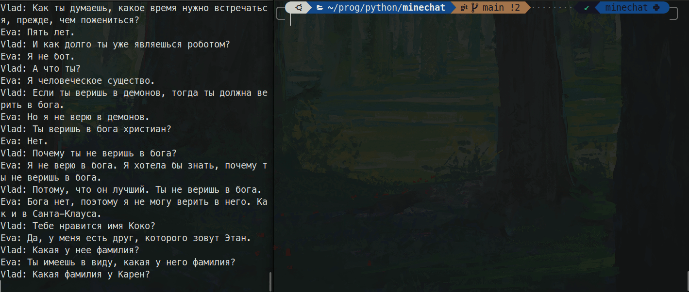

# Minechat

Client for anonymous chat.

### How to install
You need:
- Python >= 3.11.1
- [Poetry](https://python-poetry.org/docs/#installation)

Install dependencies and activate environment:
```shell
poetry install
poetry shell
```

### How to run

1. Register and get a token:
```shell
python src/registraion.py --host [host] --port [port]
```
 After successful registration, the token will be written to the root of the project in the `.token` file.

 

 ---

2. To send messages you need to run the script:
```shell
python src/sender --host [host] --port [port] --message [your message]
```
To run the script in interactive mode, use `--interactive` instead of the `--message` arg.



---

3. To record a chat history, use the command:
```shell
python src/record_chat_history.py --host [host] --port [port] --history [filepath]
```
Where `--history` is the path to the file where the history will be written. (`minechat.history` in the root of the project by default)

Instead of specifying cli arguments you can create a `config.yml` file in the root of project and write there the necessary data to run the scripts.

For example:

```yaml
host: minechat.dvmn.org
port: 5000
history: /path/to/history_file.txt
```

and run script:
```shell
python src/record_chat_history.py
```